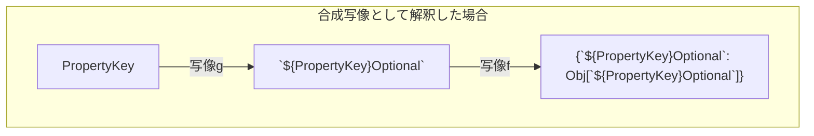
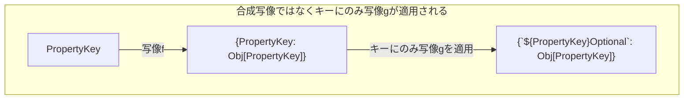

## Mapped Types
Mapped Typesは他の型をもとにオブジェクト型を生成できる機能で、`{[P in T]: U}`という構文で表されます。
```ts
type Obj = {
    num: number
    str: string
    foo: boolean
}

type MappedObj = {
    [PropertyKey in keyof Obj]: string | number
}
// type MappedObj = {
//     num: string | number;
//     str: string | number;
//     foo: string | number;
// }

```
上のコード例では、`Obj`型のプロパティキーをもち、値の型が`string | number`であるようなオブジェクト型`MappedObj`が新たに生成されています。
&nbsp; 
`{[P in T]: U}`という構文の`T`に使用できる型はプロパティのキーとして指定できる型^[`string | number | symbol`型のことで、`keyof`の上界とも呼ばれる型です。]
の部分型である必要があります。
```ts
type MappedObj = {
    [PropertyKey in Boolean]: string | number
}
```
```
Type 'Boolean' is not assignable to type 'string | number | symbol'.(2322)
```
## 集合・写像との関連
Mapped Typesという名前にあるmap は数学では写像を意味します。
写像の定義は次のようになっています。
「$A$と$B$を集合とするとき、$A$のどんな元に対しても$B$の元を一つずつ対応させる規則が与えられた場合、その規則そのもののことを集合$A$から集合$B$への**関数**または**写像**という.」^[引用：内田伏一.「集合と位相」(1986). 裳華房. p.16]
&nbsp; 
この定義から、Mapped Types`{[P in T]: U}`は写像であると捉えることができます。
`T`をプロパティキーの集合と捉えると、集合`T`の元`P`に対して、プロパティ値の型の集合の元`U`を一つずつ対応させていますので、この規則は確かに写像であると捉えられると思います。

## Mapping Modifiers （マッピング修飾子）
Mapped Typesにはマッピング修飾子というものを指定することで、プロパティをオプショナルなものにしたり、`readonly`にすることができます。
`readonly`としたい場合には、`{readonly [P in T]: U}`のように`readonly`を追加すればよく、オプショナルにしたい場合には、`{[P in T]?: U}`のように`?`を追加することで実現できます。
また、`{-readonly [P in T]: U}`や`{[P in T]-?: U}`のように`-`を付加することで`readonly`を外したり、オプショナルでなくすこともできます。
```ts
type Obj = {
    num?: number
    readonly str: string
    foo: boolean
}

type MappedObj = {
    -readonly [PropertyKey in keyof Obj] ?: Obj[PropertyKey]
}
// type MappedObj = {
//     num?: number | undefined;
//     str?: string | undefined;
//     foo?: boolean | undefined;
// }
```
この`-readonly`や`?`はマッピング修飾子（Mapped Modifiers）と呼ばれ、`Readonly`型や`Required`型など、ユーティリティ型の実装にも使用されています。
https://zenn.dev/axoloto210/articles/advent-calender-2023-day21

## as によるKey Remapping
Mapped TypesにはKey Remapping というプロパティキーに変更を加える機能が備わっています。
`{[P in T as V]: U}`という構文で表され、`V`に使用できるのは`T`と同じく`string | number | symbol`の部分型のみです。
```ts
type Obj = {
    num: number
    str: string
    foo: boolean
}


type MappedObj = {
    [PropertyKey in keyof Obj as `${PropertyKey}Optional`]?: Obj[PropertyKey]
}
// type MappedObj = {
//     numOptional?: number | undefined;
//     strOptional?: string | undefined;
//     fooOptional?: boolean | undefined;
// }
```
上のコード例では、`keyof Obj`型に含まれるプロパティキー`num`、`str`、`foo`のそれぞれに対して、プロパティキーを`` as `${PropertyKey}Optional` ``を通して`numOptional`、`strOptional`、`fooOptional`に変換し（remapping）、値の型`Obj[PropertyKey]`をオプショナルにして対応づけています。
## Key Remappingは合成写像？
集合`keof Obj`の元`PropertyKey`に`Obj[PropertyKey]`をそれぞれ対応させる写像を$f$、集合`keyof Obj`の元`PropertyKey`を`` `${PropertyKey}Optional` ``へ対応させる写像を$g$とすると、`MappedObj`型は$f∘g$という合成写像によって$f(g($`keyof Obj`$))$が生成されていると解釈できるのではないかと考えました。

しかし合成写像であるならば、最終的に得られる型は`` {`${PropertyKey}Optional`: Obj[`${PropertyKey}Optional`]} ``となってしまい、値の型が存在しないものとなってしまいます。
実際に得られる型`` {`${PropertyKey}Optional`: Obj[PropertyKey]} ``のプロパティは写像を使って表してみると、`g(PropertyKey): Obj[PropertyKey]`という対応になっています。
これは、`PropertyKey`に写像$f$が適用された後に、プロパティキーに対してのみ写像$g$が適用された形となっています。

プロパティキーのみが写像$g$によって形を変えることから、**Key Remapping**という「キーのみが再度写像によってうつされる」ことを表した命名となっているのだろうと感じますね。